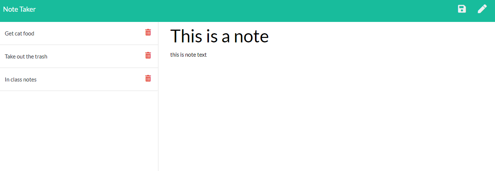

# Note Taker 

## Description
This is a simple note taking app. It is a fullstack app deployed on heroku, creation, reading, and deletion all implemented.

## Table of Contents
1. [Description](#description)
2. [Installation](#installation)
3. [Usage](#usage)
4. [License](#license)
5. [Contributing](#contributing)
6. [Tests](#tests)
7. [Questions](#questions)

## Installation
npm install

## Usage
'npm start' or go to https://jtotah-note-taker.herokuapp.com

## License
The MIT License

## Contributing
James Totah

## Tests
none

## Questions

- Github Profile: [jtwob](https://github.com/jtwob)
- Email: jtotah@usfca.edu